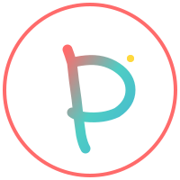

# pico-agent

> pico (p) = $$10^-12$$ (trillionth)

_barebones alternative to langchain/langgraph, smolagents, pydantic ai etc_

A very small and simple framework(defines the way of thinking/interacting) for building language model agents.
The primary purpose is to lay out a clean and quickly understandable abstraction for agents. You don't need to read large docs, or fight with the framework to customize it.

pico-agent provides the standard structure, and common features like traces(for observability/debugging), and interactions between models, tools, and agents. It gives you complete freedom to define and use any model, tool, or agentic flow/graph.

This is suited for when you will be probably working on some custom experiment, where you define your own agentic flows, and tools. Standard frameworks like langchain are built with the purpose to facilitate fast idea to production for any agentic flow. pico-agent is not production ready, it's meant for recreational purposes.

> pico-agent is a learning ramp, and hacker's paradise, ideal for play, and research.

- You can implement your own model by inheriting the `Model` interface. To call any llm model you can call via their API, inference locally, by using any popular library. Use whatever you want, just wrap it up with the `Model` interface, and you can plug that model into the system.
- You can implement any tool you wish, by inhering the `Tool`, where you define the pre and post prompt formatting of tool call, and tool response, and also the actual tool execution function
- You can define a custom `ToolEngine` that manages tool calls. It decides what tool to call, how many tool calls to make, and every decision around tool calling. Particularly useful if you wish to define some custom metric or algorithm for tool call decisions instead of purely relying on LLM or standard flows defined in other frameworks.
- You can chain up model calls sequences, or tool routing sequences, and package everything end to end in one single `Agent` that accomplishes one task
- You can define multiple agents that can interact among themselves. [in roadmap]

If you need integrations with lots of popular tools, models and agentic workflows then something like langchain/langraph is more suitable. But if you are working on some custom project, where you need to hack lots of internal bits, to customize everything, welcome to pico-agent!

Contribute your ideas/feedback via creating issues. I plan to hand-write this small library to have absolute control and a solid mental map of everything. _Not accepting code from LLMs or other humans_.
